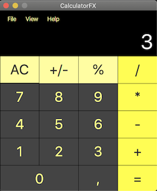
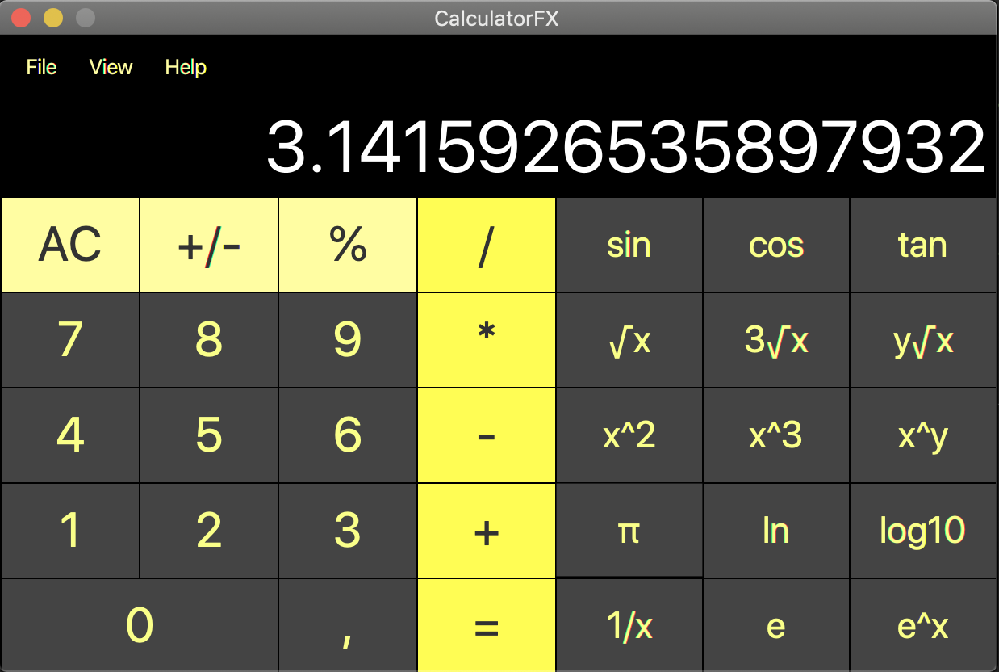

# CalculatorFX

Simple calculator that uses Reversed Polish Notation (RPN) for performing calculations. 

Calculator have 2 modes: Standard View and Scientific View.

Made with JavaFX

## Standard View:

## Scientific View:

